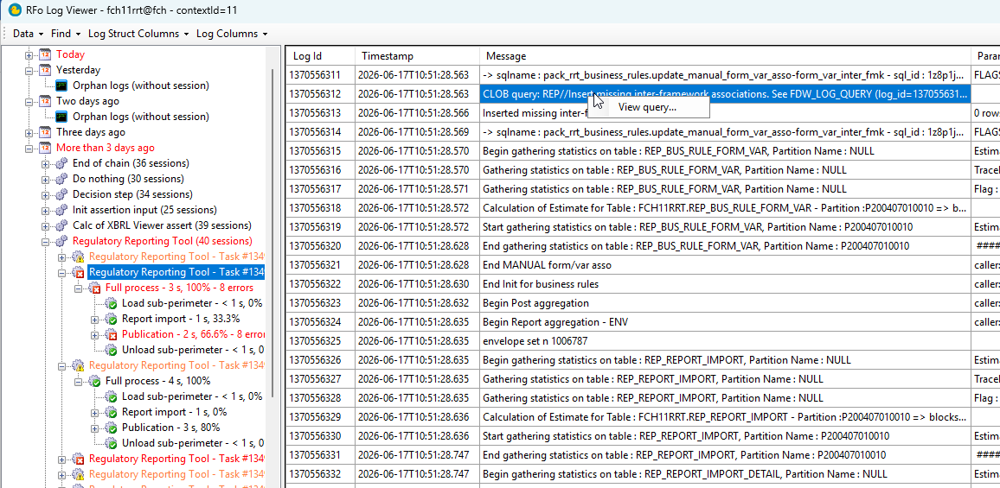
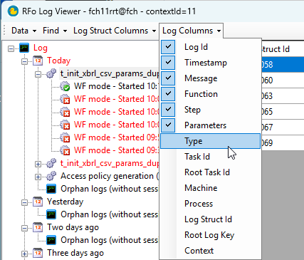
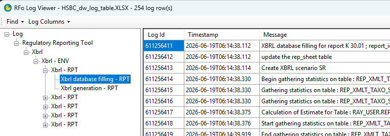

# RFo Log Viewer

A simple and efficient Windows tool to read and analyze logs from database environments, or from logs exported to Excel workbooks.

## Features

### Explore logs and retrieve dynamic queries

Browse logs in a tree view grouped by date and session. Right-click a log entry that contains a saved query and choose **View query...** to open or download the dynamic SQL from the database.



### Customize columns for readability

Show or hide columns from the **Log Columns** and **Log Struct Columns** menus. The tool remembers your column visibility, order, and widths between sessions.



### Read exported Excel logs

Open an Excel workbook (typically exported from MAUIWeb) and explore it with the same tree view and data grid as live database logs — no database connection required.



## Requirements

- Windows
- .NET Framework 4.8 (included on recent Windows versions)
- For database access: network reachability to the target Oracle database

## Download

Pre-built releases are published by GitHub Actions:

- **Releases** — check the [Releases](https://github.com/ma-fch/rfo-log-viewer/releases) page for `RfoLogViewer.zip`
- **CI artifacts** — each successful build on `main` also uploads a zip under the workflow run's **Artifacts** tab

## Installation

1. Download `RfoLogViewer.zip`.
2. Extract **all** files to a folder of your choice (for example `C:\Tools\RfoLogViewer`).
3. Run `RfoLogViewer.exe`.

> Keep all files from the archive together in the same folder. The executable depends on the DLLs shipped alongside it.

## Usage

When the application starts, a connection dialog is displayed. Choose one of the two modes below.

### Open an Excel log file

1. Click **Open Excel File...**
2. Select an Excel workbook containing exported logs from MAUIWeb

No database connection is required for this mode.

### Connect to a database

1. Enter your **Login** and **Password**
2. Enter the **DB connection id** — this can be:
   - a **TNS alias** defined in your `tnsnames.ora`, if Oracle client naming is configured on your machine, or
   - a full **data source / connection string**, for example:  
     `adb-xxx.ad.regbanking.net/db1_pdb1`
3. Enter the **Context ID** (RFo context id, for example 1)
4. Click **OK**

The main window opens and loads the logs for the selected context.

## Troubleshooting

### Blocked by Windows Defender

If Windows Defender blocks the application and clicking **Unblock** on the Defender pop-up still does not help, add an exclusion from an **elevated** (admin) PowerShell prompt:

```powershell
Add-MpPreference -ExclusionPath 'C:\Tools\RfoLogViewer\RfoLogViewer.exe'
```

Replace `C:\Tools\RfoLogViewer` with the folder where you extracted the tool.

### Connection timeout to DB

If you get a timeout error when trying to reach any DataBase, despite it seems to work when using `sqlplus`, it may be due to an invalid LDAP configuration.
- Search / open the file %oracle_home%\network\admin\ldap.ora
- Try to comment on the `DIRECTORY_SERVERS` line by adding a leading `#`
- Try again to connect to a DB with RfoLogViewer

### Persistent settings

RfoLogViewer stores its settings in %LOCALAPPDATA%\RfoLogViewer\*\*\user.config as per the .NET Framework configuration system.

## Building from source

Requires Visual Studio 2022 (or MSBuild) and the .NET Framework 4.8 developer pack.

```powershell
nuget restore RfoLogViewer.sln
msbuild RfoLogViewer.sln /p:Configuration=Release
```

The output is in `RfoLogViewer\bin\Release\`.
